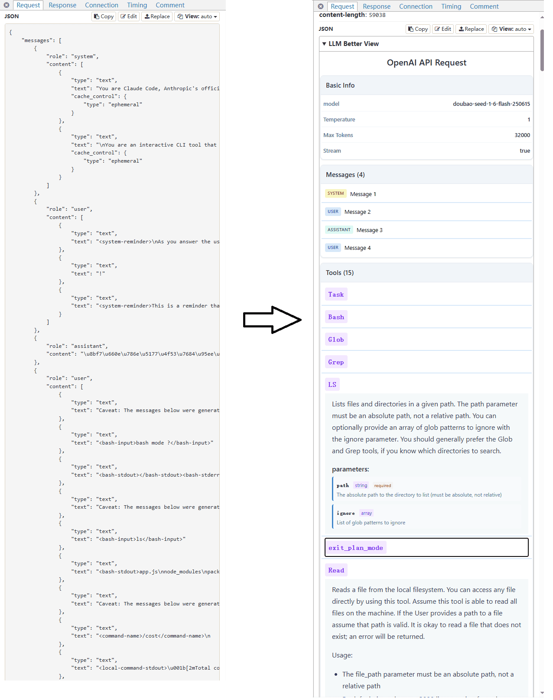

# Better view request body and response body of LLM APIs in mitmproxy

Support for OpenAI Chat Completions, OpenAI Responses API, and Anthropic Messages API.




[中文文档](./docs/README_CN.md)

## Quick Start
This project provides two tools (**The two are conflicting**):
1. mitmproxy addon scripts, which can be added when executing mitmproxy/mitmweb
2. (mitmweb only) Tampermonkey script

### Method 1: mitmproxy addon scripts

```bash
git clone https://github.com/slow-groovin/mitmproxy-llm-better-view.git
```

Add persistent configuration in `~/.mitmproxy/config.yaml`:

#### For OpenAI Chat Completions API:
```yaml
# ... your other configs
scripts:
  - <dir path>/addon/openai_req.py
  - <dir path>/addon/openai_res.py
  - <dir path>/addon/openai_res_sse.py
```

#### For Anthropic Messages API:
```yaml
# ... your other configs
scripts:
  - <dir path>/addon/anthropic_req.py
  - <dir path>/addon/anthropic_res.py
  - <dir path>/addon/anthropic_res_sse.py
```

#### For OpenAI Responses API:
```yaml
# ... your other configs
scripts:
  - <dir path>/addon/openai_responses_req.py
  - <dir path>/addon/openai_responses_res.py
```

#### Load all APIs at once:
```yaml
# ... your other configs
scripts:
  # OpenAI Chat Completions
  - <dir path>/addon/openai_req.py
  - <dir path>/addon/openai_res.py
  - <dir path>/addon/openai_res_sse.py
  # Anthropic Messages
  - <dir path>/addon/anthropic_req.py
  - <dir path>/addon/anthropic_res.py
  - <dir path>/addon/anthropic_res_sse.py
  # OpenAI Responses
  - <dir path>/addon/openai_responses_req.py
  - <dir path>/addon/openai_responses_res.py
```

> You can also specify the scripts at launch using the `-s` parameter:
> ```bash
> # OpenAI Chat Completions
> mitmweb -s ./addon/openai_req.py -s ./addon/openai_res.py -s ./addon/openai_res_sse.py
> 
> # Anthropic Messages
> mitmweb -s ./addon/anthropic_req.py -s ./addon/anthropic_res.py -s ./addon/anthropic_res_sse.py
> 
> # OpenAI Responses
> mitmweb -s ./addon/openai_responses_req.py -s ./addon/openai_responses_res.py
> ```

### Method 2: Tampermonkey script

visit and install:

https://greasyfork.org/scripts/540917-mitmproxy-llm-better-view

## How It Works
### Method 1: mitmproxy addon scripts

This uses mitmproxy's [contentviews](https://docs.mitmproxy.org/stable/addons/contentviews/) to convert the request body and response content of LLM APIs into Markdown format for better viewing.

#### Supported APIs:
- **OpenAI Chat Completions API** (`/v1/chat/completions`): Full support for streaming and non-streaming requests
- **Anthropic Messages API** (`/v1/messages`): Full support for streaming and non-streaming requests, including tool use
- **OpenAI Responses API** (`/v1/responses`): Support for structured outputs with JSON schemas

### Method 2: Tampermonkey script

Uses JS to fetch data on the page, render it as static HTML, and embed it into the page via an iframe.

## Features

### OpenAI Chat Completions API Support
- Request body parsing with model, temperature, messages, and tools
- Response parsing for both streaming (SSE) and non-streaming formats
- Tool calls and function calling support
- Reasoning content support (for models like o1)

### Anthropic Messages API Support
- Request body parsing with model, max_tokens, system prompts, and messages
- Response parsing for both streaming (SSE) and non-streaming formats
- Multi-modal content support (text, images, tool use, tool results)
- Tool definitions and tool use tracking
- Stop reasons and stop sequences

### OpenAI Responses API Support
- Request body parsing with structured input and response format schemas
- Response parsing with structured outputs
- JSON schema validation support
- Token usage tracking