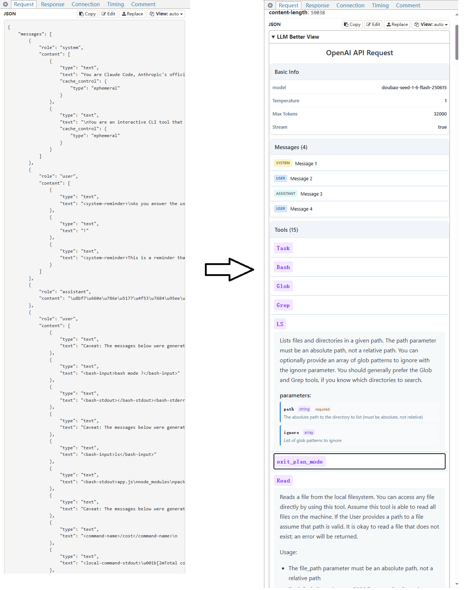

# 在 mitmproxy 中更好的查看 LLM API 的请求和响应

支持 OpenAI Chat Completions、OpenAI Responses API 和 Anthropic Messages API。




[English README](../README.md)

## 快速开始
本项目提供了两种工具：
1. mitmproxy addon 脚本，可在 mitmproxy 运行时通过参数添加
2. （仅支持 mitmweb）Tampermonkey 脚本

### 方式1：mitmproxy addon 脚本

```bash
git clone https://github.com/slow-groovin/mitmproxy-llm-better-view.git
```

在 `~/.mitmproxy/config.yaml` 中添加持久化配置：

#### 对于 OpenAI Chat Completions API：
```yaml
# ... 你的其他配置
scripts:
  - <目录路径>/addon/openai_req.py
  - <目录路径>/addon/openai_res.py
  - <目录路径>/addon/openai_res_sse.py
```

#### 对于 Anthropic Messages API：
```yaml
# ... 你的其他配置
scripts:
  - <目录路径>/addon/anthropic_req.py
  - <目录路径>/addon/anthropic_res.py
  - <目录路径>/addon/anthropic_res_sse.py
```

#### 对于 OpenAI Responses API：
```yaml
# ... 你的其他配置
scripts:
  - <目录路径>/addon/openai_responses_req.py
  - <目录路径>/addon/openai_responses_res.py
```

#### 同时加载所有 API：
```yaml
# ... 你的其他配置
scripts:
  # OpenAI Chat Completions
  - <目录路径>/addon/openai_req.py
  - <目录路径>/addon/openai_res.py
  - <目录路径>/addon/openai_res_sse.py
  # Anthropic Messages
  - <目录路径>/addon/anthropic_req.py
  - <目录路径>/addon/anthropic_res.py
  - <目录路径>/addon/anthropic_res_sse.py
  # OpenAI Responses
  - <目录路径>/addon/openai_responses_req.py
  - <目录路径>/addon/openai_responses_res.py
```

> 你也可以在启动时通过 `-s` 参数指定脚本：
> ```bash
> # OpenAI Chat Completions
> mitmweb -s ./addon/openai_req.py -s ./addon/openai_res.py -s ./addon/openai_res_sse.py
> 
> # Anthropic Messages
> mitmweb -s ./addon/anthropic_req.py -s ./addon/anthropic_res.py -s ./addon/anthropic_res_sse.py
> 
> # OpenAI Responses
> mitmweb -s ./addon/openai_responses_req.py -s ./addon/openai_responses_res.py
> ```

### 方式2：Tampermonkey 脚本

直接安装:

https://greasyfork.org/scripts/540917-mitmproxy-llm-better-view

## 工作原理
### 方式1：mitmproxy addon 脚本

本工具利用 mitmproxy 的 [contentviews](https://docs.mitmproxy.org/stable/addons/contentviews/) ，将 LLM API 的请求体和响应内容转换为 Markdown 格式进行展示。

#### 支持的 API：
- **OpenAI Chat Completions API** (`/v1/chat/completions`)：完全支持流式和非流式请求
- **Anthropic Messages API** (`/v1/messages`)：完全支持流式和非流式请求，包括工具使用
- **OpenAI Responses API** (`/v1/responses`)：支持带有 JSON schema 的结构化输出

### 方式2：Tampermonkey 脚本

通过 JS 在页面内获取数据并渲染为静态 HTML，然后通过 iframe 嵌入页面显示。

## 功能特性

### OpenAI Chat Completions API 支持
- 请求体解析，包括 model、temperature、messages 和 tools
- 流式（SSE）和非流式响应解析
- 工具调用和函数调用支持
- 推理内容支持（针对 o1 等模型）

### Anthropic Messages API 支持
- 请求体解析，包括 model、max_tokens、system prompts 和 messages
- 流式（SSE）和非流式响应解析
- 多模态内容支持（文本、图片、工具使用、工具结果）
- 工具定义和工具使用跟踪
- 停止原因和停止序列

### OpenAI Responses API 支持
- 请求体解析，包括结构化输入和响应格式 schema
- 结构化输出的响应解析
- JSON schema 验证支持
- Token 使用情况跟踪
