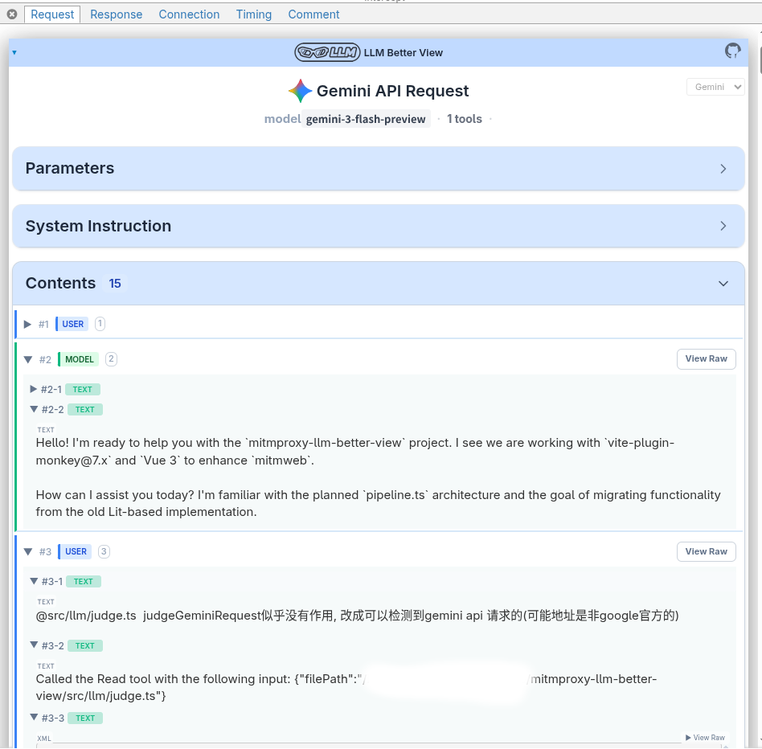
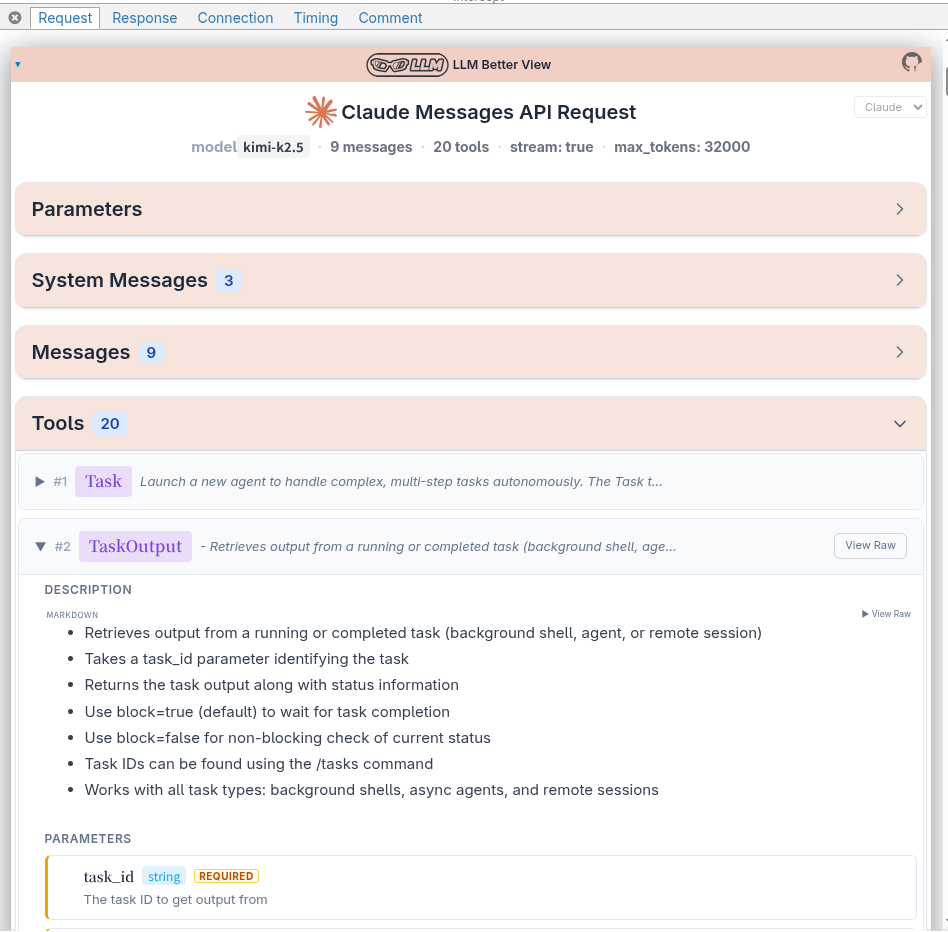
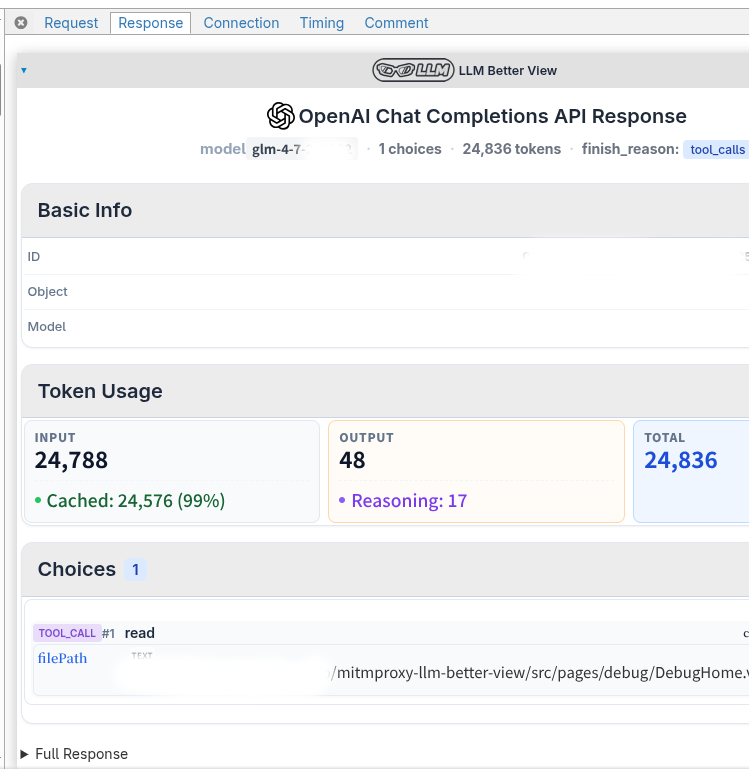

# Mitmproxy LLM Better View

<div align="center">
  <imgser src="../src/assets/icon.png" height="24" alt="icon" />
  <span style="vertical-align: middle; font-size: 24px;"> Mitmproxy LLM Better View</span>
</div>

一个用于在 mitmweb 中可视化大模型 API 请求/响应的 Tampermonkey 脚本。

<details>
  <summary>查看截图</summary>
  
  *截图1:*
  
  *截图2:*
  
  *截图3:*
  
</details>

## 功能特性

- **请求/响应可视化**: 格式化显示消息、工具和元数据
- **多平台支持**: OpenAI Chat Completion、Claude 和 Gemini
- **SSE 支持**: 处理流式响应
- **可折叠区域**: 折叠/展开消息和工具调用

## 安装

> 如果你没有在 8081 或 9090 端口上运行 mitmweb，那么你**必须**修改 Tampermonkey 脚本的匹配 URL 为你使用的地址。

### 从 GreasyFork 安装（推荐）

直接从以下地址安装：https://greasyfork.org/scripts/540917-mitmproxy-llm-better-view

### 手动安装

从发布页面下载，然后手动安装

### 手动构建

```bash
# 克隆仓库
git clone https://github.com/slow-groovin/mitmproxy-llm-better-view.git
cd mitmproxy-llm-better-view

# 安装依赖
npm install

# 构建脚本
npm run build

# 输出文件将在 dist/mitmproxy-llm-better-view.user.js
```

## 使用方法

1. 安装 Tampermonkey 脚本
2. 在浏览器中打开 mitmweb
3. 点击任意 LLM API 请求/响应以查看增强视图

## 开发

```bash
# 启动开发服务器（支持热重载）
npm run dev
```

## 说明

本功能依靠作者使用方式进行测试开发, 无法覆盖到所有API使用场景, 欢迎提ISSUE增加对未覆盖的参数/类型的支持

## 未来计划

1. ollama api
2. openai response api

## 相关项目

- [mitmproxy](https://mitmproxy.org/) - 一个交互式的支持 TLS 拦截的 HTTP 代理
- [Tampermonkey](https://www.tampermonkey.net/) - 世界上最流行的用户脚本管理器
