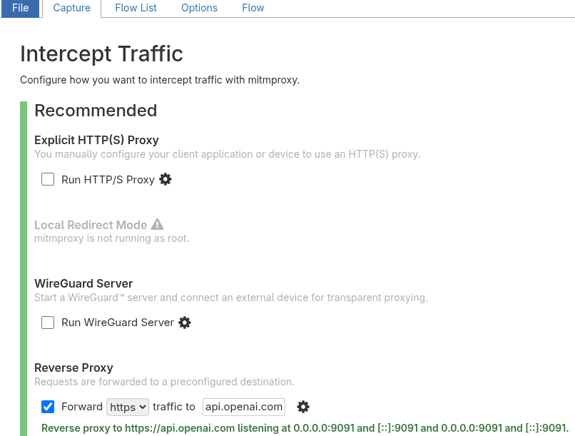
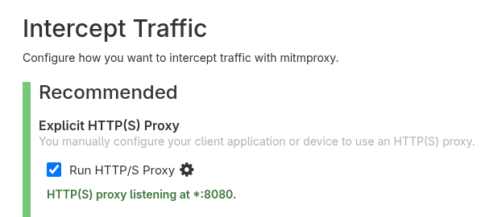
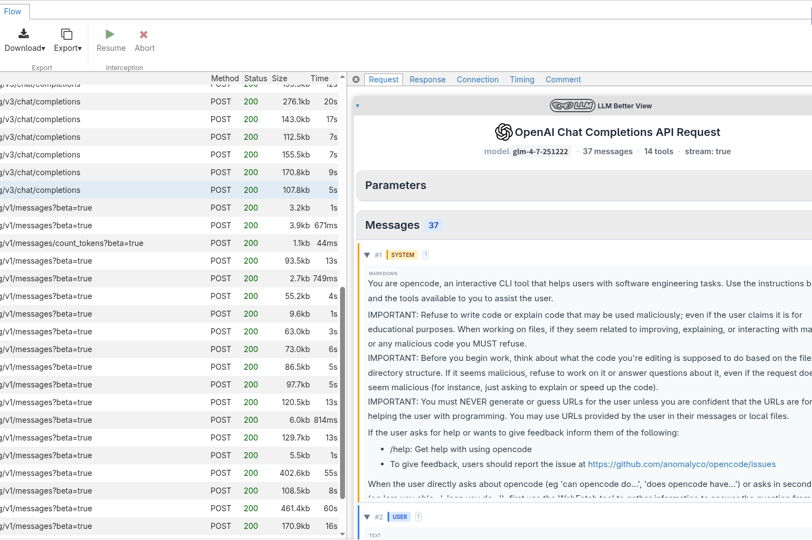

<div align="center">

<h1>Mitmproxy LLM Better View</h1>
</div>

**一个用于在 mitmweb 中可视化大模型 API 请求/响应的 Tampermonkey 脚本。**

<a href="../README.md">English README</a>

<details>
  <summary>截图</summary>

  *1:*
  
  *2:*
  
  *3:*
  
</details>

## 为什么需要这个？

当使用 `Claude Code` 或 `OpenCode` 等 AI 应用时，如果你能看到这些工具聚合了什么上下文输入给 LLM，以及 LLM 输出了什么，你就能更好地理解这些工具的工作原理。你也会更清楚地知道该向 LLM 提供什么来获得想要的结果。

## 使用方法

### 步骤 1. 安装 mitmproxy

确保你已安装 mitmproxy。

> mitmweb 是 mitmproxy 的基于 Web 的 GUI。

---

### 步骤 2. 配置流量

按如下方式设置请求流：

```
你的应用  →  mitmproxy  →  目标 API
```

---

<details>
<summary>opencode / cline / cherrystudio / vercel ai sdk / 其他</summary>

大多数工具都提供如 `baseURL`（或类似字段）的配置选项。

#### 1️⃣ 在 mitmweb 中配置反向代理

在 mitmweb 中设置反向代理：



#### 2️⃣ 替换 API 端点

更新应用的端点以指向你的 mitmproxy 反向代理地址。

⬇️ 以 opencode 为例（`~/.config/opencode.jsonc`）：

```json
{
  "npm": "@ai-sdk/openai-compatible",
  "options": {
    // "baseURL": "https://api.openai.com/v1/",
    "baseURL": "http://localhost:9091/v1/"
  }
}
```

> ⚠️ 注意：反向代理端点使用 **http**，不是 https。

</details>

---

<details>
<summary>claude code / gemini-cli (Node.js CLI)</summary>

如果你使用第三方 API，设置与上面相同。

#### 1️⃣ 在 mitmweb 中配置反向代理


#### 2️⃣ 替换端点

⬇️ 以 Claude Code 为例：

```bash
# ~/.bashrc 或 ~/.zshrc

# export ANTHROPIC_BASE_URL="https://your-original-api-endpoint.com/api/coding"
export ANTHROPIC_BASE_URL="http://localhost:9091/api/coding"
```

---

### 如果你使用官方 Claude 计划

虽然 Claude Code 是基于 Node.js 构建的，但你可以在 mitmweb 中配置**显式 HTTP(S) 代理**：



然后设置以下环境变量：

```bash
export NODE_TLS_REJECT_UNAUTHORIZED=0   # 允许不安全证书
export HTTPS_PROXY=http://127.0.0.1:8080
```

</details>

---

<details>
<summary>codex (Rust CLI)</summary>

如果你使用第三方 API，设置与前面的示例类似。

#### 1️⃣ 在 mitmweb 中配置反向代理


#### 2️⃣ 替换基础 URL

```toml
# ~/.codex/config.toml

[model_providers.your-provider]
name = "your-provider"
# base_url = "https://your-provider-endpoint/api/v1"
base_url = "http://localhost:9091/api/v1"
env_key = "ARK_API_KEY"
wire_api = "chat"
requires_openai_auth = false

[profiles.your-provider-profile]
model = "<Model_Name>"
model_provider = "your-provider"
```

---

#### 如果你使用官方 ChatGPT 计划

这会更复杂一些。

由于 Codex 是用 Rust 构建的，你不能使用：

```bash
export NODE_TLS_REJECT_UNAUTHORIZED=0
```

来绕过证书验证。

你可能需要在系统信任存储中安装并信任 mitmproxy CA 证书。

</details>

---

### 步骤 3. 安装 Tampermonkey 脚本

如果你的 mitmweb **没有** 运行在 `localhost:8081` 或 `localhost:9091`，你必须在 Tampermonkey 脚本中手动添加匹配规则，例如：

```js
// @match  http://127.0.0.1:8081/*
```

#### 从 GreasyFork 安装（推荐）

直接从以下地址安装：  
https://greasyfork.org/scripts/540917-mitmproxy-llm-better-view

#### 手动安装

从发布页面下载并手动安装。

> 如果 mitmweb 没有运行在 `8081` 或 `9090` 端口，你**必须**更新 Tampermonkey 脚本内的匹配 URL。

1. 安装 Tampermonkey 脚本  
2. 在浏览器中打开 mitmweb  

---

### 步骤 4. 使用和查看

一切配置完成后：

1. mitmproxy 应该会捕获请求。
2. 点击任何捕获的请求。
3. 你会在右侧看到增强面板。



## 功能特性

- **请求/响应可视化**：格式化显示消息、工具和元数据
- **多平台支持**：OpenAI Chat Completion、Claude 和 Gemini
- **SSE 支持**：处理流式响应
- **可折叠区域**：折叠/展开消息和工具调用

## 支持

- openai
  - /chat/completion api
- gemini
  - /v1beta api
- claude
  - /v1/messages api

### TODO
- Ollama API
- OpenAI Response API

## 说明

本功能依靠作者使用方式进行测试开发，无法覆盖到所有 API 使用场景，欢迎提 ISSUE 增加对未覆盖的参数/类型的支持。

## 相关项目

- [mitmproxy](https://mitmproxy.org/) - 一个交互式的支持 TLS 拦截的 HTTP 代理
- [Tampermonkey](https://www.tampermonkey.net/) - 世界上最流行的用户脚本管理器
- 如果你不想安装 tampermonkey 脚本，你也可以使用这个在线可视化请求/响应：[ai-api-visualizer](https://github.com/slow-groovin/ai-api-visualizer)